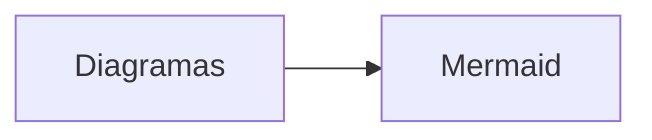

Texto de abertura.

## Seção

Markdown comum: **negrito**, _itálico_, [links](https://exemplo.com), listas, tabelas e citações.

```python
print("blocos de código têm destaque de sintaxe")
```


```mermaid
flowchart LR
  A[Diagramas] --> B[Mermaid]
```
